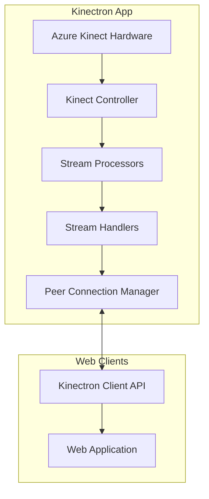

# Contributing to Kinectron

Thank you for your interest in contributing to Kinectron!. This document provides comprehensive guidelines for developers who want to modify and contribute to the Kinectron codebase.

## Overview

Kinectron consists of two main components:

1. **Application (`app/`)**: An Electron-based desktop application that interfaces with the Azure Kinect hardware and broadcasts data over WebRTC
2. **Client API (`client/`)**: A JavaScript library that connects to the Kinectron server and provides methods for accessing different data streams



## Repository Structure

```
kinectron/
├── app/                  # Electron application
│   ├── main/             # Main process code
│   │   ├── handlers/     # Stream handlers
│   │   ├── managers/     # Resource managers
│   │   └── processors/   # Stream processors
│   ├── preload/          # Preload scripts
│   └── renderer/         # Renderer process code
├── client/               # Client library
│   ├── src/              # Client source code
│   │   ├── peer/         # Peer connection code
│   │   ├── streams/      # Stream handlers
│   │   └── utils/        # Utility functions
│   └── tools/            # Developer tools
│       ├── connection-tester/ # Connection testing interface
│       └── stream-tester/     # Stream testing interface
├── examples/             # Example applications
│   ├── package.json      # Examples package configuration
│   └── p5_examples/      # Examples using p5.js
│       ├── gettingstarted/      # UMD example (script tag approach)
│       └── gettingstarted_module/ # ES Module example
└── memory-bank/          # Project documentation
```

## Getting Started

### Prerequisites

1. [Node.js](https://nodejs.org/) (v14 or higher)
2. [Git](https://git-scm.com/)
3. [Azure Kinect SDK](https://docs.microsoft.com/en-us/azure/kinect-dk/sensor-sdk-download) (for application development)
4. [Visual Studio Build Tools](https://visualstudio.microsoft.com/visual-cpp-build-tools/) (for application development)

### Setting Up the Development Environment

1. Fork the repository to your account, and then clone it to your computer:

```bash
git clone https://github.com/YOURGITHUBHANDLE/kinectron.git
cd kinectron
```

2. Install all dependencies from the root directory:

```bash
npm install
```

This will install dependencies for all workspaces (app, client, and examples) in a single command, leveraging npm workspaces.

## Application Development (Windows Only)

You can develop the server application from **Windows only**. This has only been tested on Windows 10/11.

### Prerequisites

1. **Azure Kinect SDK**: Install the [Azure Kinect SDK](https://docs.microsoft.com/en-us/azure/kinect-dk/sensor-sdk-download).

2. **Visual Studio Build Tools**: Install Visual Studio Build Tools with "Desktop Development with C++ Workload" selected. This is required for compiling the native Node.js bindings to the Azure Kinect SDK.

   Note: The project uses native Node.js modules that require compilation during installation. The npm install command from the root directory will handle this, but you need to have the proper build tools installed.

3. Copy body tracking models into application folder

   In order for the body tracking for Azure Kinect to work, you will need to have several DLL and ONNX files in the root of your application. The install script of the kinect-azure module tries to copy these files automatically. You should have files like the following in your application root after running npm install:

   - onnxruntime.dll
   - dnn_model_2_0.onnx
   - cublas64_100.dll
   - cudart64_100.dll
   - vcomp140.dll
   - cudnn64_7.dll

   If you can't find these files, copy them from inside node_modules/kinect-azure to the kinectron/app folder.

4. Run the electron application:

   ```bash
   npm run start:app
   ```

   This will run the start script in the app workspace from the root directory.

### Stream Implementation Pattern

When implementing a new stream or modifying an existing one, follow this pattern:

1. **Server-Side Processor**: Create or modify a processor in `app/main/processors/` that extends `BaseFrameProcessor`
2. **Server-Side Handler**: Create or modify a handler in `app/main/handlers/` that extends `BaseStreamHandler`
3. **Client-Side API**: Add or update methods in `client/src/kinectron.js`
4. **Client-Side Handler**: Add or update handlers in `client/src/streams/streamHandlers.js`
5. **Testing**: Test the stream in the streamTest example

### Debugging System

Kinectron includes a comprehensive debugging system with flag-based controls:

1. **Debug Flags**: Located in `app/main/utils/debug.js` and `client/src/utils/debug.js`
2. **Categories**: FRAMES, UI, PEER, PERFORMANCE, DATA, NETWORK, HANDLERS
3. **Usage**:
   - Enable all: `DEBUG.enableAll()`
   - Enable specific: `DEBUG.FRAMES = true`
   - Log with category: `log.frame('Frame received')`

### Error Handling and Notification System

The application includes a robust notification system for error handling:

1. **NotificationManager**: Singleton class in `app/renderer/js/utils/notificationManager.js`
2. **Modal Dialogs**: Used for displaying error messages and troubleshooting steps
3. **Console Fallback**: Falls back to console notifications when the modal can't be shown

### Building a Release

To create a packaged application:

```bash
npm run build:app
```

Or if you need to run the package command directly:

```bash
cd app && npm run package
```

This will create an application for the platform and architecture of the computer you are working on. To learn more about packaging options, read the [Electron Packager documentation](https://github.com/electron-userland/electron-packager).

## Client Library Development (Cross-Platform)

You can develop the client-side API from Mac or PC.

### Project Structure

The Kinectron client consists of:

- **src/**: Modern ES module source files for the client library
- **tools/**: Developer tools for testing and debugging
  - **connection-tester/**: For testing basic connectivity to the Kinect server
  - **stream-tester/**: For testing and visualizing different data streams
- **dist/**: Build output directory (generated by Rollup)

### Setup

Since all dependencies are installed from the root directory using npm workspaces, you don't need to run a separate install command for the client library.

2. Make changes to the source files in `client/src/`:

   - `kinectron.js`: Main client API
   - `peer/`: Peer connection code
   - `streams/`: Stream handlers
   - `utils/`: Utility functions

3. Build the library with your changes:

```bash
npm run build:client
```

This will create a bundled version of the client library in the `client/dist` directory.

### Development Workflow

#### Running the Stream Test

To run the stream test interface:

```bash
npm run test:client:stream
```

This will:

1. Clean the Parcel cache and dist directory
2. Build the client library from src/index.js
3. Start a development server with the streamTest example
4. Open the page in your default browser

#### Building the Client Library

To build the client library:

```bash
npm run build:client
```

This will:

1. Clean the Parcel cache and dist directory
2. Build the client library from src/index.js
3. Output the result to the dist directory

#### Continuous Development

If you'd like to make several changes over time, Parcel can watch your files for changes and automatically rebuild:

```bash
npm run dev:client
```

Use Ctrl+C to stop this process.

### Known Issues and Solutions

#### Parcel Caching Issues

When making changes to JavaScript files that are directly included in HTML (not imported via ES modules), you may encounter issues with Parcel's caching mechanism. Changes to these files might not be reflected in the browser even when using the development server with hot reloading.

#### Symptoms

- Changes to files in the `tools/stream-tester/js/controllers/` directory don't appear in the browser
- Console logs show old code is still running
- UI behavior doesn't match your updated code

#### Solution

If you encounter caching issues, you can manually clear Parcel's cache:

```bash
npm run clean:client
```

The npm scripts have been updated to automatically clear the cache before each run, but if you're still experiencing issues, you can run the clean script manually.

### Direct DOM Manipulation

Some parts of the codebase use direct DOM manipulation to enable/disable UI elements. When refactoring or modifying UI-related code, be aware that there might be multiple places where the same DOM elements are being manipulated.

For example, the stream buttons in tools/stream-tester/index.html are controlled by:

1. The initial HTML attributes (`disabled`)
2. The UIController.js methods (`enableStreamButtons`, `disableStreamButtons`)
3. Direct DOM manipulation in event handlers

When making changes to UI behavior, make sure to check all these locations to ensure consistent behavior.

### Best Practices

1. **Use ES Modules**: When possible, use ES module imports rather than direct script tags in HTML
2. **Test Changes Thoroughly**: After making changes, test all related functionality to ensure nothing was broken
3. **Clear Cache When Needed**: If you suspect caching issues, clear the Parcel cache
4. **Check Console Logs**: Use the browser console to verify that your changes are being loaded correctly

## Code Style and Conventions

1. **Modern JavaScript**: Use ES6+ features (classes, arrow functions, async/await)
2. **JSDoc Comments**: Add JSDoc comments for public methods and interfaces
3. **Consistent Naming**: Follow existing naming conventions
4. **Error Handling**: Include proper error handling with try/catch blocks
5. **Logging**: Use the debug logging system instead of direct console.log calls

## Pull Request Process

1. **Fork the Repository**: Create your own fork of the repository
2. **Create a Branch**: Create a branch for your feature or bugfix
3. **Make Changes**: Implement your changes following the code style guidelines
4. **Test**: Test your changes thoroughly
5. **Submit PR**: Submit a pull request with a clear description of the changes

## Troubleshooting Common Development Issues

### Application Won't Start

1. Check that all required DLL files are in the app folder
2. Verify that the Azure Kinect SDK is installed
3. Check that no other application is using the Kinect
4. Look for error messages in the console

### Stream Not Working

1. Check that the Kinect is properly initialized
2. Verify that the stream handler is registered correctly
3. Check for data structure mismatches between server and client
4. Enable debug logs to see detailed information

### Client Connection Issues

1. Check that the server is running
2. Verify that the client is using the correct IP address or Ngrok URL
3. Check for firewall issues
4. Enable PEER debug logs to see connection details

### Data Structure and Naming Convention Inconsistencies

There are some inconsistencies in naming conventions between the server and client:

- Case differences (imageData vs. imagedata)
- Format differences (depth-key vs depthKey)
- Inconsistent use of hyphens vs camelCase

These issues have been addressed with workarounds for specific streams, but a systematic approach to standardize naming conventions is planned for future updates.

## Additional Resources

- [Azure Kinect Documentation](https://docs.microsoft.com/en-us/azure/kinect-dk/)
- [Electron Documentation](https://www.electronjs.org/docs)
- [PeerJS Documentation](https://peerjs.com/docs.html)
- [Parcel Documentation](https://parceljs.org/docs/)
- [Rollup Documentation](https://rollupjs.org/guide/en/)
