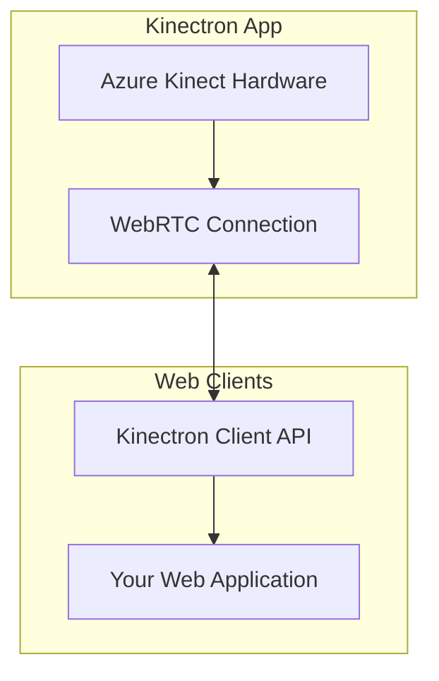

# Kinectron

Kinectron is an Electron-based application that enables real-time streaming of Microsoft Azure Kinect data into web browsers using WebRTC. It provides a simple way for creative coders, interactive designers, and researchers to access depth-sensing data in web applications without the need for native code.

## Kinectron Version 1.0.0

Kinectron is now at version 1.0.0, which fully supports the Azure Kinect with all data streams implemented and thoroughly tested. This release represents a complete rewrite of the codebase with a modern, modular architecture and improved performance.

### Version 1.0.0 Highlights:

- **Complete Stream Support**: All Azure Kinect data streams are fully implemented and working
- **Modern Architecture**: Modular JavaScript architecture with clear separation of concerns
- **Comprehensive Documentation**: Detailed guides and API documentation
- **Multiple Distribution Formats**: Support for ESM, CJS, and UMD with CDN availability

If you are looking for support for the Kinect 2 for Windows, see the legacy version 0 (unsupported as of May 2025).

## Features

- **Real-time Streaming**: Stream Azure Kinect data to web browsers with minimal latency
- **Multiple Data Streams**: Access color, depth, raw depth, body tracking, key, RGBD, and depth key
- **Remote Connections**: Connect to Kinect data from anywhere using Ngrok tunneling
- **Visualization Tools**: Built-in visualization examples using p5.js and Three.js
- **Broadcast Controls**: Block API calls while still allowing streaming data for teaching or performance broadcast

## Architecture

Kinectron uses a server-client architecture to stream data from the Azure Kinect to web browsers:



For detailed information about the architecture and internal components, please see [CONTRIBUTE.md](CONTRIBUTE.md).

## Installation

### Hardware Requirements

- Microsoft Azure Kinect
- Windows 10/11 computer with USB 3.0 port
- Sufficient processing power for real-time data handling. See [Azure Kinect system requirements](https://learn.microsoft.com/en-us/previous-versions/azure/kinect-dk/system-requirements)

### Software Prerequisites

1. [Azure Kinect SDK](https://docs.microsoft.com/en-us/azure/kinect-dk/sensor-sdk-download)

### Application Installation Steps

**Option 1 - Download Release (Recommended)** Download the latest release from the [releases page](https://github.com/kinectron/kinectron/releases)

OR

**Option 2 - Clone and build from source (Advanced)**

1.  ```bash
    git clone https://github.com/kinectron/kinectron.git
    cd kinectron
    npm install
    ```

2.  Start the application:
    ```bash
    npm run start:app
    ```

## Getting Started

### Running the Application

1. Connect your Azure Kinect device to your computer
2. Launch the Kinectron application
3. The application will display the server IP address and port for client connections
4. Click the "Open Kinect" button to initialize the device

### Connecting Clients

#### Local Connection (Simplified - Recommended)

```javascript
// Include the Kinectron client library in your HTML
<script src="https://cdn.jsdelivr.net/npm/kinectron-client@latest/dist/kinectron.umd.js"></script>;

// Create a new Kinectron instance with just the server IP
const kinectron = new Kinectron('127.0.0.1'); // Enter IP address from application here!

// Set up connection event handler
kinectron.on('ready', () => {
  console.log('Connected to Kinectron server');
});

// Connect to the server
kinectron.peer.connect();
```

#### Local Connection (Advanced Configuration)

```javascript
// Create a new Kinectron instance with detailed configuration
const kinectron = new Kinectron({
  host: '127.0.0.1', // Enter IP address from application here!
  port: 9001, // Custom port if needed
  path: '/', // Custom path if needed
  secure: false, // Use true for HTTPS connections
});

// Set up connection event handler
kinectron.on('ready', () => {
  console.log('Connected to Kinectron server');
});

// Connect to the server
kinectron.peer.connect();
```

#### Remote Connection (using Ngrok)

1. Create a free account at [ngrok.com](https://ngrok.com/) and copy your authtoken
2. In the Kinectron application, enter your authtoken and click "Create Public Address"
3. Use the provided Ngrok URL in your client code:

```javascript
// Create a new Kinectron instance with just the Ngrok URL
const kinectron = new Kinectron('your-ngrok-url.ngrok-free.app');

// Set up connection event handler
kinectron.on('ready', () => {
  console.log('Connected to Kinectron server via Ngrok');

  // Set Kinect type (azure)
  kinectron.setKinectType('azure');
});

// Connect to the server
kinectron.peer.connect();
```

### Block API Control

The Kinectron application includes a "Block API Calls" button that prevents clients from controlling the Kinect while still allowing streaming data. This is useful for public installations, teaching scenarios, or performances where you want to stream data but don't want to allow remote control of the device.

When API calls are blocked:

- Incoming API calls from clients are blocked
- Outgoing streams continue to function
- The button text toggles between "Block API Calls" and "Allow API Calls"
- The status text indicates whether API calls are allowed or blocked

## Available Streams

Kinectron provides access to the following data streams, all of which are fully implemented and working:

### Color Stream

RGB color image from the Azure Kinect camera.

```javascript
// Start the color stream
kinectron.startColor((colorFrame) => {
  // Process the color frame
  // colorFrame contains an image data URL
  document.getElementById('colorImage').src = colorFrame.src;
});
```

### Depth Stream

Processed 8-bit gray scale depth image from the Azure Kinect depth sensor.

```javascript
// Start the depth stream
kinectron.startDepth((depthFrame) => {
  // Process the depth frame
  // depthFrame contains an image data URL
  document.getElementById('depthImage').src = depthFrame.src;
});
```

### Raw Depth Stream

Native 16-bit depth data from the Azure Kinect depth sensor, useful for precise depth measurements and point cloud visualization.

```javascript
// Start the raw depth stream
kinectron.startRawDepth((rawDepthFrame) => {
  // Process the raw depth frame
  // rawDepthFrame contains already unpacked depth data in the depthValues property
  const depthData = rawDepthFrame.depthValues;

  // Use the depth data for visualization or analysis
  visualizePointCloud(depthData);
});
```

### Body Tracking

Skeleton data for multiple tracked bodies, including joint positions and orientations.

```javascript
// Start the body tracking stream
kinectron.startBodies((bodyFrame) => {
  // Process the body frame
  // bodyFrame.bodies contains an array of skeleton data
  if (bodyFrame.bodies.length > 0) {
    drawSkeleton(bodyFrame.bodies[0]);
  }
});
```

### Key (Green Screen)

Body segmentation data that separates people from the background.

```javascript
// Start the key stream
kinectron.startKey((keyFrame) => {
  // Process the key frame
  // keyFrame contains an image data URL with transparent background
  document.getElementById('keyImage').src = keyFrame.src;
});
```

### RGBD (Color + Depth)

Combined color and depth data, useful for creating colored point clouds. Alpha channel in RGBA image is used to store 8-bit depth data.

```javascript
// Start the RGBD stream
kinectron.startRGBD((rgbdFrame) => {
  // Process the RGBD frame
  // rgbdFrame contains aligned color and depth data
  document.getElementById('rgbdImage').src = rgbdFrame.src;
});
```

### Depth Key

Combined depth data with body segmentation, providing native 16-bit depth information only for detected bodies in the scene.

```javascript
// Start the depth key stream
kinectron.startDepthKey((depthKeyFrame) => {
  // Process the depth key frame
  // depthKeyFrame contains depth data only for people in the scene
  visualizeFilteredPointCloud(depthKeyFrame);
});
```

## Client API

The Kinectron client API provides methods for connecting to the server and accessing different data streams.

### Connection Methods

- `peer.connect()`: Establishes a connection to the Kinectron server
- `on(event, callback)`: Registers a callback for specific events:
  - `'ready'`: Fired when connection is established
  - `'error'`: Fired when an error occurs
  - `'stateChange'`: Fired when connection state changes
  - `'data'`: Fired when data is received
- `getState()`: Returns the current connection state
- `isConnected()`: Returns whether the client is connected to the server
- `close()`: Closes the connection and cleans up resources

### Stream Control Methods

- `startColor(callback)`: Starts the color stream
- `startDepth(callback)`: Starts the depth stream
- `startRawDepth(callback)`: Starts the raw depth stream
- `startBodies(callback)`: Starts the body tracking stream
- `startKey(callback)`: Starts the key (green screen) stream
- `startRGBD(callback)`: Starts the RGBD stream
- `startDepthKey(callback)`: Starts the depth key stream
- `stopAll()`: Stops all active streams

## Examples

Kinectron includes two different types of examples to demonstrate different ways of using the library:

### Example Types

1. **UMD (Universal Module Definition) Example**

   - Located in `/examples/p5_examples/gettingstarted/`
   - Uses traditional script tags to load the library
   - Simpler approach for beginners or educational settings
   - Works directly in browsers without a build step
   - Uses global p5.js functions

2. **ES Module Example**
   - Located in `/examples/p5_examples/gettingstarted_module/`
   - Uses modern ES module imports
   - Demonstrates integration with module bundlers
   - Uses p5.js in instance mode (required for ES modules)
   - Better for production applications and modern development workflows

### Running the Examples

To run the examples, install dependencies from the project root:

```bash
# From the root directory
npm install
```

#### Running the UMD Example

```bash
# From the root directory
npm run examples:umd
```

This will:

- Build the client library with the UMD format
- Start a development server
- Open the UMD example in your browser

#### Running the ES Module Example

```bash
# From the root directory
npm run examples:module
```

This will:

- Build the client library with the ES module format
- Start a development server
- Open the ES module example in your browser

### Key Differences in Code

**UMD Example (Traditional Script Tags):**

```html
<!-- Include the UMD build of Kinectron -->
<script src="../../../client/dist/kinectron.umd.js"></script>

<!-- Your sketch code -->
<script src="sketch.js"></script>
```

```javascript
// Global p5.js functions
function setup() {
  // Create Kinectron instance
  kinectron = new Kinectron('127.0.0.1');

  // Connect to server
  kinectron.peer.connect();
}
```

**ES Module Example (Modern Imports):**

```html
<!-- Your sketch code - using type="module" to enable ES module imports -->
<script src="sketch.js" type="module"></script>
```

```javascript
// Import Kinectron from the npm package
import Kinectron from 'kinectron-client';

// Create a p5 instance - required when using ES modules with p5.js
const sketch = (p) => {
  p.setup = function () {
    // Create Kinectron instance
    kinectron = new Kinectron('127.0.0.1');

    // Connect to server
    kinectron.peer.connect();
  };
};

// Start the sketch with the p5 instance
new p5(sketch);
```

### Which Example Should You Use?

- **UMD Example**: Best for beginners, educational settings, or quick prototypes
- **ES Module Example**: Best for production applications, modern development workflows, or when using build tools

Both examples demonstrate the same core functionality but use different module loading approaches.

### Additional Examples

#### Stream Test Example

The Stream Test example provides a comprehensive interface for testing all available streams and visualizing the data using both p5.js and Three.js.

To run the Stream Test example:

```bash
# From the root directory
npm run test:stream
```

#### Simple Connection Test

The Simple Connection Test example provides a minimal implementation for testing the connection to the Kinectron server.

To run the Simple Connection Test:

```bash
# From the root directory
npm run test
```

## Troubleshooting

### Common Issues

#### Kinect Device Not Found

If the Kinect device is not found when clicking "Open Kinect":

1. Ensure the Azure Kinect is properly connected to a USB 3.0 port
2. Check that the Azure Kinect SDK is installed
3. Verify that no other application is using the Kinect
4. Try restarting the Kinectron application

The application will display a modal dialog with troubleshooting steps if the Kinect device isn't connected. The "Open Kinect" button remains active even when initialization fails, allowing you to retry the connection.

#### Connection Issues

If clients cannot connect to the Kinectron server:

1. Ensure the client is using the correct IP address or Ngrok URL
2. Check that the client and server are on the same network (for local connections)
3. Verify that no firewall is blocking the connection
4. Try restarting both the server first, then the client

#### Stream Issues

If streams are not working correctly:

1. Check the console for error messages
2. Ensure the Kinect is properly initialized
3. Try stopping and restarting the stream
4. Verify that the client is properly handling the received data

### Debugging

Kinectron includes a comprehensive debugging system with flag-based controls. In the Stream Test example, you can enable different categories of debug logs:

- **FRAMES**: Logs related to frame processing and transmission
- **UI**: Logs related to UI interactions
- **PEER**: Logs related to peer connections
- **PERFORMANCE**: Logs related to performance metrics
- **DATA**: Logs related to data integrity
- **NETWORK**: Logs related to network operations
- **HANDLERS**: Logs related to stream handler operations

To enable debugging in your own application:

```javascript
// Enable all debug flags
window.DEBUG.enableAll();

// Or enable specific flags
window.DEBUG.FRAMES = true;
window.DEBUG.PERFORMANCE = true;
```

Essential logs (errors, warnings, important info) are always visible, while non-essential logs (debug, frame, UI) are only visible when the corresponding flags are enabled.

## Development

For detailed information about developing and contributing to Kinectron, please see [CONTRIBUTE.md](CONTRIBUTE.md).

This document covers:

- Project structure and architecture
- Setting up the development environment
- Building and testing both the application and client library
- Code style and conventions
- Pull request process
- Troubleshooting common development issues

## Contributing

We welcome contributions to Kinectron. Please see [CONTRIBUTE.md](CONTRIBUTE.md) for guidelines on how to contribute to the project.

## License

This project is licensed under the MIT License - see the [LICENSE](LICENSE) file for details.

## Credits and Support 

Kinectron Version 1 is generously supported by an [APOSSIBLE](https://apossible.com/) Applied Experiments grant. 

Kinectron is maintained by [Lisa Jamhoury](https:lisajamhoury.com) with support from Aarón Montoya-Moraga. It was originally developed by Shawn van Every and Lisa Jamhoury at New York University's Interactive Telecommunications Program ([NYU ITP](https://tisch.nyu.edu/itp)) under the Google xStory Experiments in Storytelling Research Grant, which supports experiments with emerging technology in service of new forms of storytelling.

Past collaborators include Stephanie Koltun, Or Fleisher, Tiri Kananuruk, and Dror Ayalon.

## Acknowledgments

- [PeerJS](https://peerjs.com/) for WebRTC peer connection
- [Azure Kinect SDK](https://docs.microsoft.com/en-us/azure/kinect-dk/sensor-sdk-download) for hardware interface
- [Electron](https://www.electronjs.org/) for cross-platform desktop application
- [Sharp](https://sharp.pixelplumbing.com/) for image processing
- [Three.js](https://threejs.org/) and [p5.js](https://p5js.org/) for visualization examples
