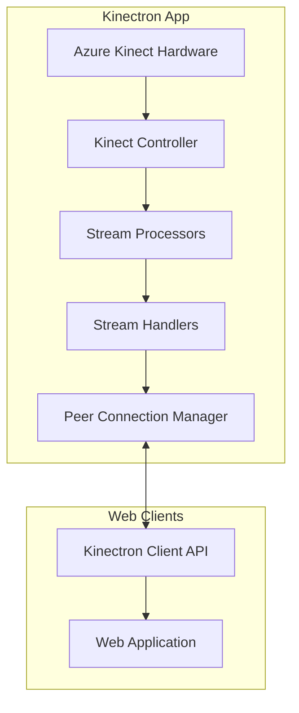
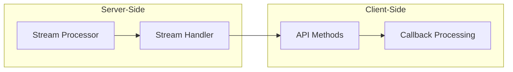
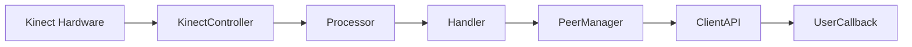
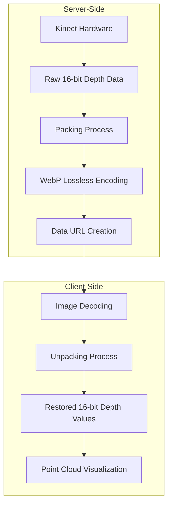
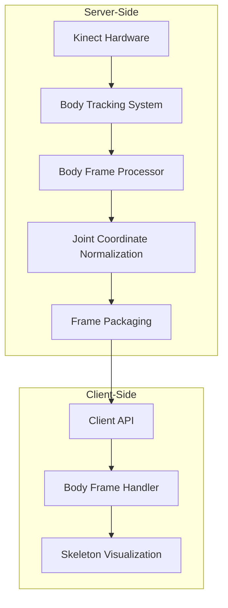
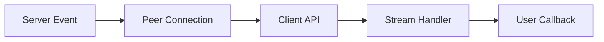
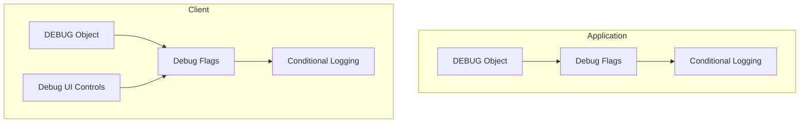

# Kinectron System Patterns

## System Architecture

Kinectron uses a modular architecture separating hardware interaction, data processing, network communication, and debugging within an Electron application.



## Core Patterns

### Handler/Processor Pattern

Each stream type follows this pattern:

1. **Base Classes**:

   - `BaseFrameProcessor`: Interface for processors
   - `BaseStreamHandler`: Interface for handlers

2. **Specialized Implementations**:

   - Processor classes (e.g., `DepthFrameProcessor`)
   - Handler classes (e.g., `DepthStreamHandler`)

3. **Responsibilities**:
   - **Processor**: Transforms raw Kinect data
   - **Handler**: Manages stream lifecycle and broadcasting

### Event-Driven Communication

1. **IPC Communication**: Main to renderer process via Electron IPC
2. **Peer Communication**: WebRTC-based for real-time streaming
3. **Client API**: Event-based interface with callbacks

## Stream Implementation



### Implementation Steps:

1. **Server-Side Processor**: Extends `BaseFrameProcessor`, transforms data
2. **Server-Side Handler**: Extends `BaseStreamHandler`, manages lifecycle
3. **Client-Side API**: Implements stream control methods
4. **Client-Side Processing**: Delivers processed frames to callbacks

## Data Flow



### Raw Depth Data Flow



### Body Tracking Data Flow



### Body Tracking Initialization Pattern

1. **Sequential Initialization**:

   - First, ensure any previous tracking is stopped
   - Start cameras with the right options
   - Create the body tracker
   - Create the frame callback
   - Start listening for frames

2. **Error Handling**:

   - Try/catch blocks around critical operations
   - Graceful error recovery
   - Detailed logging for diagnostics

3. **State Management**:
   - Track active state to prevent multiple overlapping initialization attempts
   - Ensure proper cleanup before starting new sessions

### Raw Depth Packing Strategy

1. **Current Implementation**:
   - One 16-bit depth value per RGBA pixel
   - Lower 8 bits stored in R channel
   - Upper 8 bits stored in G channel
   - B and A channels unused (set to 0 and 255)
   - Unpacking: `depth = (G << 8) | R`

## Component Relationships

1. **KinectController**: Manages hardware interface
2. **Stream Processors**: Transform specific data types
3. **Stream Handlers**: Manage stream lifecycle
4. **PeerConnectionManager**: Handles WebRTC connections
5. **Client API**: Provides interface for web applications
6. **Debugging System**: Controls logging and diagnostics

## Design Patterns Used

1. **Factory Pattern**: Creating processors and handlers
2. **Observer Pattern**: Event handling and notification
3. **Strategy Pattern**: Different processing strategies
4. **Template Method**: Base classes defining algorithms
5. **Adapter Pattern**: Converting between data formats
6. **Facade Pattern**: Simplified debugging interface

## Data Structure Handling Patterns

### Event Data Structure Mismatches

A critical pattern to be aware of is the potential mismatch between data structures in the event pipeline:



**Problem**: Data structures can be nested differently than expected between event producers and consumers.

**Example**: In the bodyFrame handler, data was coming in as:

```javascript
{
  data: {
    bodies: [...],
    numBodies: 1
  },
  name: "bodyFrame",
  timestamp: 1743208345517
}
```

But the handler was looking for `data.bodies` directly, causing the callback to never be called.

**Solution**: Extract the nested data before processing:

```javascript
export function createBodyHandler(callback) {
  return (eventData) => {
    const bodyData = eventData.data;
    if (bodyData && bodyData.bodies) {
      callback({
        bodies: bodyData.bodies,
        timestamp: bodyData.timestamp || Date.now(),
        floorClipPlane: bodyData.floorClipPlane,
        trackingId: bodyData.trackingId,
      });
    }
  };
}
```

**Best Practice**: Add proper logging at the beginning of handler functions to verify data structure. Consider standardizing data extraction across all handlers.

## Debugging System Architecture



### Debugging System Implementation

1. **Flag-Based Control**:

   - Master flags for component-level control (e.g., RAW_DEPTH)
   - Category flags for specific log types (PERFORMANCE, DATA, PEER)
   - All flags default to false (disabled)

2. **UI Integration**:

   - Checkbox controls in streamTest.html
   - Master toggle enables/disables all debugging
   - Category toggles for fine-grained control

3. **Conditional Logging**:
   - Console logs wrapped with flag checks
   - Console.group() for organizing related logs
   - Essential vs. non-essential message differentiation

## Build System and Development Workflow

```mermaid
flowchart TD
    subgraph "Development Process"
        Clean[Clean Cache]
        Build[Build Client Library]
        Serve[Serve StreamTest]
        Test[Test in Browser]
    end

    subgraph "File Organization"
        SrcFiles[ES Module Source Files (src/)]
        ExampleFiles[Example Applications (examples/)]
        HTMLFiles[HTML Entry Points]
        StyleFiles[CSS Files]
    end

    Clean --> Build --> Serve --> Test
    SrcFiles --> Build
    ExampleFiles --> Serve
    HTMLFiles --> Serve
    StyleFiles --> Serve
```

### Build System Implementation

1. **Parcel Bundler**:

   - Zero-configuration bundler for web applications
   - Handles JavaScript, HTML, CSS, and assets
   - Provides development server with hot module replacement
   - Requires cache management for direct script includes

2. **File Organization**:

   - `src/`: Core client API files (ES modules)
   - `examples/`: Example applications and testing interfaces
     - `streamTest/`: Stream testing interface with visualization tools
     - `test/`: Simple connection testing interface
   - `dist/`: Build output directory (generated by Parcel)

3. **Development Workflow**:
   - Clean script removes cache and build artifacts
   - Build process compiles ES modules into browser-compatible code
   - Serve process starts development server with live reloading
   - Browser testing validates functionality
