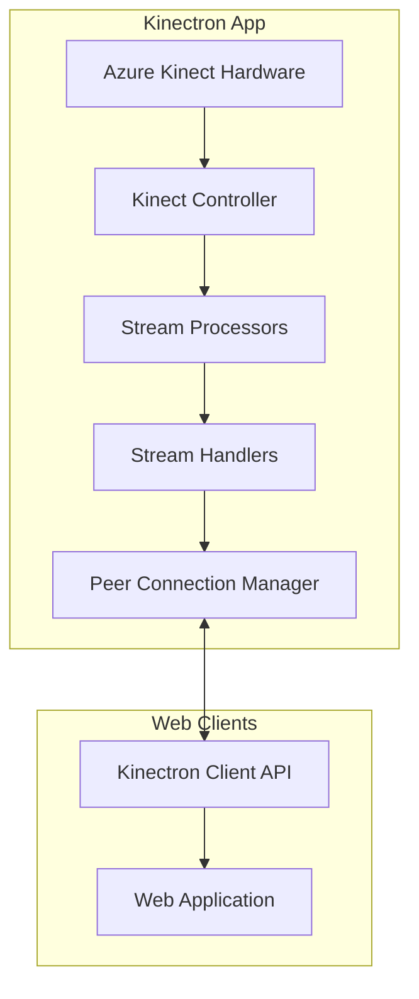
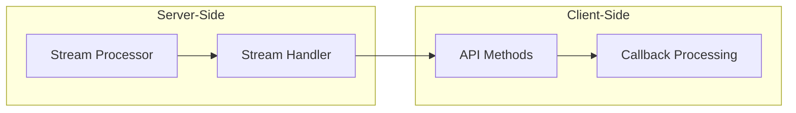
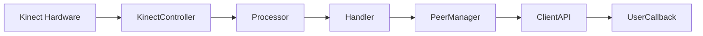

# Kinectron System Patterns

## System Architecture

Kinectron uses a modular architecture separating hardware interaction, data processing, and network communication within an Electron application.

## Core Patterns

### Handler/Processor Pattern

Each stream type follows this pattern:

1. **Base Classes**:

   - `BaseFrameProcessor`: Interface for processors
   - `BaseStreamHandler`: Interface for handlers

2. **Specialized Implementations**:

   - Processor classes (e.g., `DepthFrameProcessor`)
   - Handler classes (e.g., `DepthStreamHandler`)

3. **Responsibilities**:
   - **Processor**: Transforms raw Kinect data
   - **Handler**: Manages stream lifecycle and broadcasting

### Event-Driven Communication

1. **IPC Communication**: Main to renderer process via Electron IPC
2. **Peer Communication**: WebRTC-based for real-time streaming
3. **Client API**: Event-based interface with callbacks

## Stream Implementation

### Implementation Steps:

1. **Server-Side Processor**: Extends `BaseFrameProcessor`, transforms data
2. **Server-Side Handler**: Extends `BaseStreamHandler`, manages lifecycle
3. **Client-Side API**: Implements stream control methods
4. **Client-Side Processing**: Delivers processed frames to callbacks

## Data Flow

## Component Relationships

1. **KinectController**: Manages hardware interface
2. **Stream Processors**: Transform specific data types
3. **Stream Handlers**: Manage stream lifecycle
4. **PeerConnectionManager**: Handles WebRTC connections
5. **Client API**: Provides interface for web applications

## Design Patterns Used

1. **Factory Pattern**: Creating processors and handlers
2. **Observer Pattern**: Event handling and notification
3. **Strategy Pattern**: Different processing strategies
4. **Template Method**: Base classes defining algorithms
5. **Adapter Pattern**: Converting between data formats
