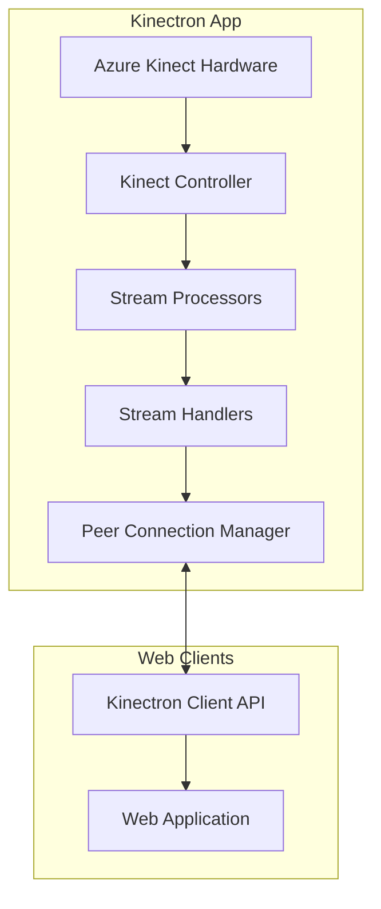
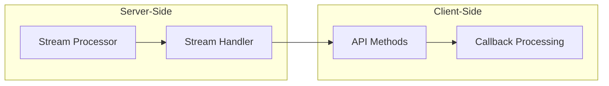
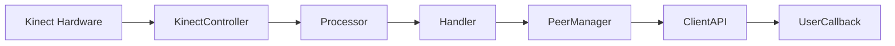
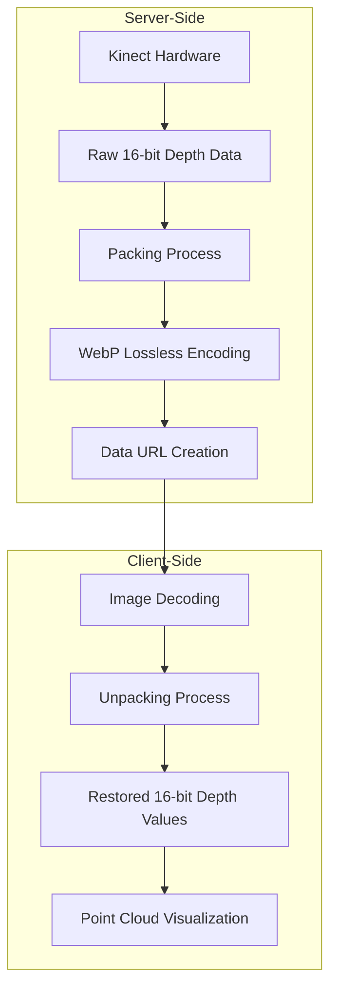
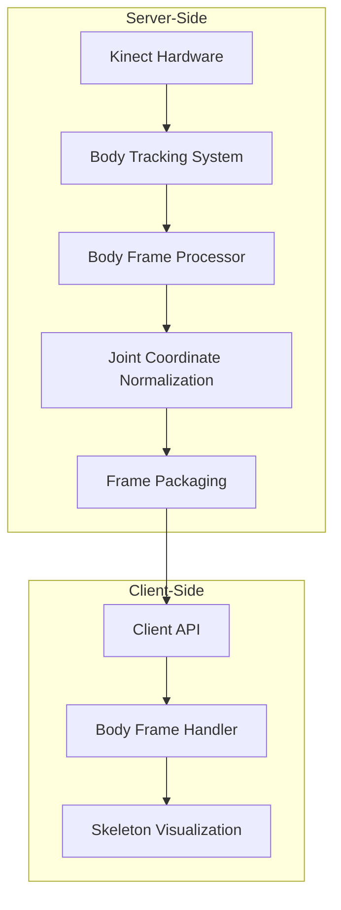
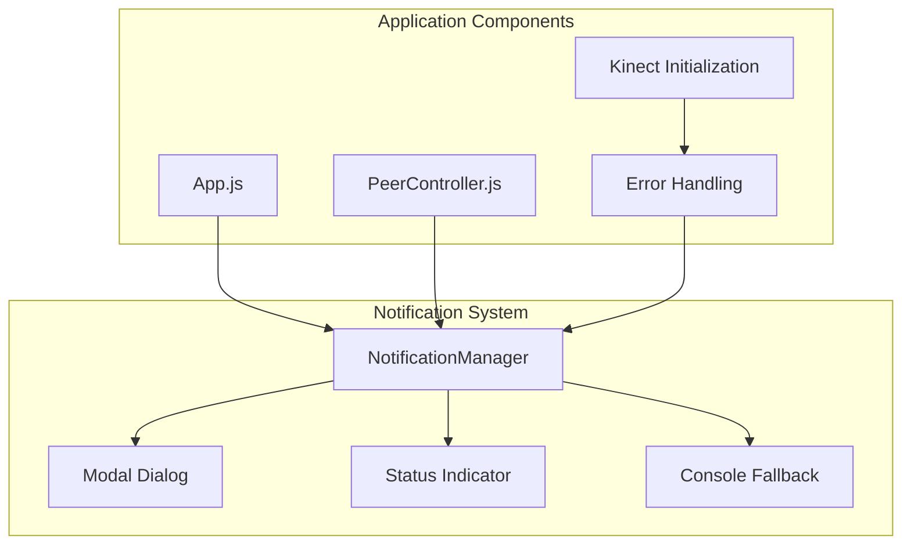
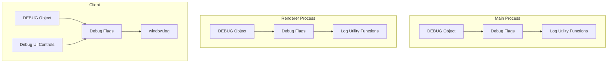

# Kinectron System Patterns

## System Architecture

Kinectron uses a modular architecture separating hardware interaction, data processing, network communication, and debugging within an Electron application.



## Core Patterns

### Handler/Processor Pattern

Each stream type follows this pattern:

1. **Base Classes**:

   - `BaseFrameProcessor`: Interface for processors
   - `BaseStreamHandler`: Interface for handlers

2. **Specialized Implementations**:

   - Processor classes (e.g., `DepthFrameProcessor`)
   - Handler classes (e.g., `DepthStreamHandler`)

3. **Responsibilities**:
   - **Processor**: Transforms raw Kinect data
   - **Handler**: Manages stream lifecycle and broadcasting

### Event-Driven Communication

1. **IPC Communication**: Main to renderer process via Electron IPC
2. **Peer Communication**: WebRTC-based for real-time streaming
3. **Client API**: Event-based interface with callbacks

## Stream Implementation



### Implementation Steps:

1. **Server-Side Processor**: Extends `BaseFrameProcessor`, transforms data
2. **Server-Side Handler**: Extends `BaseStreamHandler`, manages lifecycle
3. **Client-Side API**: Implements stream control methods
4. **Client-Side Processing**: Delivers processed frames to callbacks

## Data Flow



### Stream-Specific Data Flows

#### Raw Depth Data Flow



#### Body Tracking Data Flow



### Stream Initialization Pattern

1. **Sequential Initialization**:

   - Stop any previous tracking
   - Start cameras with appropriate options
   - Create frame callback
   - Start listening for frames

2. **Error Handling**:

   - Try/catch blocks around critical operations
   - Graceful error recovery

3. **State Management**:
   - Track active state to prevent overlapping initialization
   - Ensure proper cleanup before starting new sessions

### Raw Depth Packing Strategy

- One 16-bit depth value per RGBA pixel
- Lower 8 bits stored in R channel
- Upper 8 bits stored in G channel
- Unpacking: `depth = (G << 8) | R`

### Frame Dropping and Buffering Strategy

- All streams use lossy transmission by default
- Frames are dropped when the network can't keep up
- Buffer checking prevents buffer bloat and reduces latency
- Prioritizes fresh data over complete data

## Component Relationships

1. **KinectController**: Manages hardware interface
2. **Stream Processors**: Transform specific data types
3. **Stream Handlers**: Manage stream lifecycle
4. **PeerConnectionManager**: Handles WebRTC connections
5. **Client API**: Provides interface for web applications
6. **Debugging System**: Controls logging and diagnostics

## Design Patterns Used

1. **Factory Pattern**: Creating processors and handlers
2. **Observer Pattern**: Event handling and notification
3. **Strategy Pattern**: Different processing strategies
4. **Template Method**: Base classes defining algorithms
5. **Adapter Pattern**: Converting between data formats
6. **Facade Pattern**: Simplified debugging interface
7. **Singleton Pattern**: NotificationManager for centralized error handling

## Notification System Architecture



## Debugging System Architecture



### Flag-Based Control

- Category-based flags for specific log types:
  - FRAMES: Frame processing and transmission logs
  - UI: UI-related logs
  - PEER: Peer connection logs
  - PERFORMANCE: Performance-related logs
  - DATA: Data integrity logs
  - NETWORK: Network-related logs
  - HANDLERS: Stream handler operations

## Module Export Pattern

```mermaid
flowchart TD
    subgraph "Export Strategy"
        SrcFiles[Source Files]
        DefaultExport[Default Export]
        ESM[ESM Format]
        CJS[CommonJS Format]
        UMD[UMD Format with PeerJS Bundled]
    end

    subgraph "Import Methods"
        ESImport[import Kinectron from 'kinectron-client']
        CJSImport[const Kinectron = require('kinectron-client')]
        ScriptImport[<script src="kinectron.umd.js"></script>]
    end

    SrcFiles --> DefaultExport
    DefaultExport --> ESM --> ESImport
    DefaultExport --> CJS --> CJSImport
    DefaultExport --> UMD --> ScriptImport
```

### Default Export Only

- The Kinectron class is exported as the default export only
- Follows best practices for libraries with a single primary class
- Provides a cleaner, more intuitive API for consumers
- PeerJS is bundled directly into the UMD build
