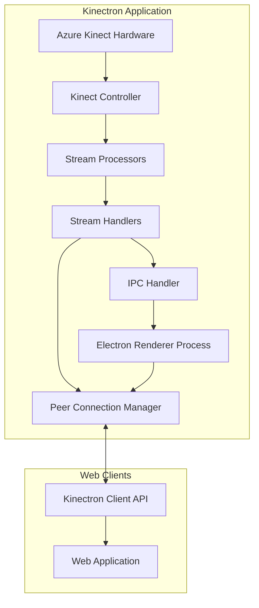
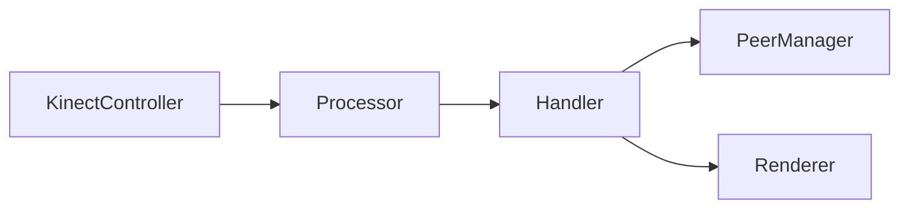
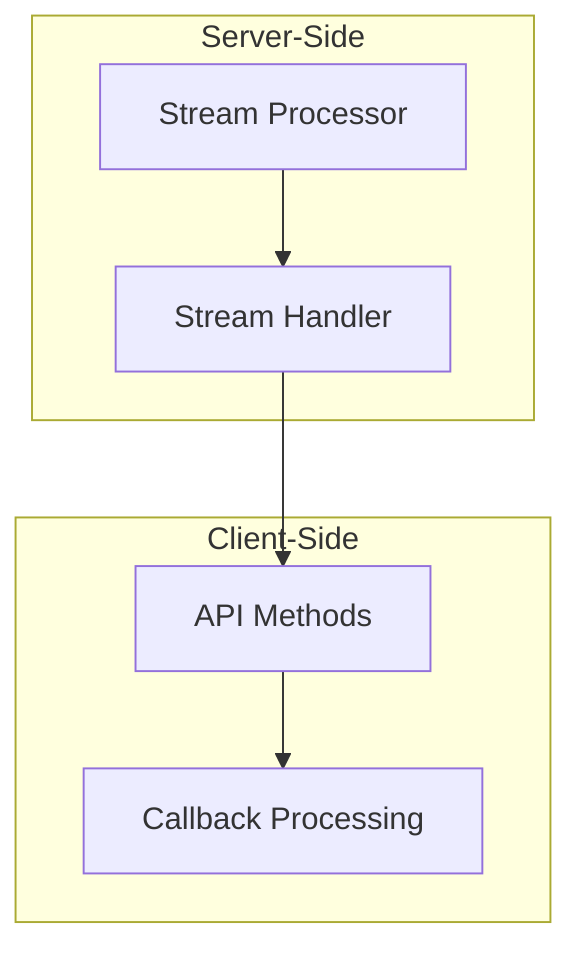
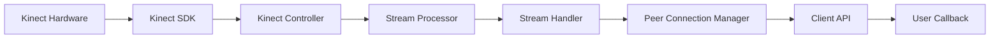

# Kinectron System Patterns

## System Architecture Overview

Kinectron follows a modular, layered architecture that separates concerns between hardware interaction, data processing, and network communication. The system is built around an Electron application that bridges the Azure Kinect hardware with web clients.

```mermaid
flowchart TD
    subgraph "Kinectron Application"
        KinectHW[Azure Kinect Hardware]
        KinectController[Kinect Controller]
        Processors[Stream Processors]
        Handlers[Stream Handlers]
        PeerManager[Peer Connection Manager]
        IpcHandler[IPC Handler]
        Renderer[Electron Renderer Process]

        KinectHW --> KinectController
        KinectController --> Processors
        Processors --> Handlers
        Handlers --> PeerManager
        Handlers --> IpcHandler
        IpcHandler --> Renderer
        Renderer --> PeerManager
    end

    subgraph "Web Clients"
        ClientAPI[Kinectron Client API]
        WebApp[Web Application]

        ClientAPI --> WebApp
    end

    PeerManager <--> ClientAPI
```

## Core Architectural Patterns

### 1. Modular Handler/Processor Pattern

The system uses a consistent pattern for processing and distributing different types of Kinect data:

```mermaid
flowchart LR
    KinectController --> Processor
    Processor --> Handler
    Handler --> PeerManager
    Handler --> Renderer
```

Each stream type (color, depth, body, etc.) follows this pattern:

1. **Base Classes**:

   - `BaseFrameProcessor`: Abstract class defining the processor interface
   - `BaseStreamHandler`: Abstract class defining the handler interface

2. **Specialized Implementations**:

   - Processor classes (e.g., `DepthFrameProcessor`, `ColorFrameProcessor`)
   - Handler classes (e.g., `DepthStreamHandler`, `ColorStreamHandler`)

3. **Responsibilities**:

   - **Processor**: Transforms raw Kinect data into a format suitable for transmission
   - **Handler**: Manages stream lifecycle, IPC communication, and peer broadcasting

### 2. Event-Driven Communication

The system uses event-driven patterns for both internal and external communication:

1. **IPC Communication**:

   - Main process to renderer process communication via Electron IPC
   - Event-based API for stream control and status updates

2. **Peer Communication**:

   - WebRTC-based peer connections for real-time data streaming
   - Event listeners for connection management and data handling

3. **Client API**:

   - Event-based interface for stream control and data reception
   - Callback pattern for frame processing

## Stream Implementation Pattern

Each stream type follows a consistent implementation pattern:

```mermaid
flowchart TD
    subgraph "Server-Side"
        SP[Stream Processor]
        SH[Stream Handler]

        SP --> SH
    end

    subgraph "Client-Side"
        API[API Methods]
        CB[Callback Processing]

        API --> CB
    end

    SH --> API
```

### Implementation Steps:

1. **Server-Side Processor**:

   - Located in `app/main/processors/[stream]Processor.js`
   - Extends `BaseFrameProcessor`
   - Implements `processFrame()` method for specific stream type
   - Handles data transformation and optimization

2. **Server-Side Handler**:

   - Located in `app/main/handlers/[stream]Handler.js`
   - Extends `BaseStreamHandler`
   - Implements stream lifecycle methods (`startStream()`, `stopStream()`)
   - Sets up IPC handlers and frame callbacks
   - Manages broadcasting to peers

3. **Client-Side API Methods**:

   - Located in `client/src/kinectron-modern.js`
   - Implements stream control methods (`start[Stream]()`, `stop[Stream]()`)
   - Sets up frame reception and callback handling

4. **Client-Side Frame Processing**:

   - Processes received frame data
   - Converts to appropriate format (e.g., data URL for images)
   - Delivers processed frames to user callbacks

## Data Flow Architecture

The data flow through the system follows a consistent pattern:

```mermaid
flowchart LR
    KinectHW[Kinect Hardware] --> KinectSDK[Kinect SDK]
    KinectSDK --> KinectController[Kinect Controller]
    KinectController --> Processor[Stream Processor]
    Processor --> Handler[Stream Handler]
    Handler --> PeerManager[Peer Connection Manager]
    PeerManager --> ClientAPI[Client API]
    ClientAPI --> UserCallback[User Callback]
```

### Key Data Transformation Points:

1. **Kinect Controller**:

   - Interfaces with the Kinect SDK
   - Configures camera settings
   - Receives raw frame data

2. **Stream Processor**:

   - Transforms raw data into usable format
   - Normalizes values (e.g., depth values to 0-255 range)
   - Optimizes data for transmission

3. **Stream Handler**:

   - Packages processed data for transmission
   - Compresses image data (e.g., using WebP format)
   - Creates data packages with metadata

4. **Client API**:

   - Receives and unpacks data packages
   - Converts data to web-friendly formats (e.g., canvas, data URLs)
   - Delivers processed data to user callbacks

## Error Handling Patterns

The system implements consistent error handling patterns:

1. **Hierarchical Error Propagation**:

   - Errors are caught at the lowest level possible
   - Meaningful error messages are added at each level
   - Errors are propagated up the chain when appropriate

2. **Graceful Degradation**:

   - System attempts to continue operation when possible
   - Non-critical errors are logged but don't crash the application
   - Users are notified of issues through status events

3. **Comprehensive Logging**:

   - Detailed logging at each processing stage
   - Performance metrics and statistics
   - Error conditions and recovery attempts

## Component Relationships

### Main Process Components:

1. **KinectController**:

   - Manages the Kinect hardware interface
   - Provides methods for starting/stopping different camera types
   - Configures camera settings for different stream types

2. **Stream Processors**:

   - Process specific types of Kinect data
   - Transform raw data into usable formats
   - Optimize data for transmission

3. **Stream Handlers**:

   - Manage the lifecycle of specific stream types
   - Handle IPC communication for stream control
   - Broadcast processed frames to peers

4. **PeerConnectionManager**:

   - Manages WebRTC peer connections
   - Handles connection establishment and termination
   - Broadcasts data to connected peers

5. **IpcHandler**:

   - Coordinates IPC communication between main and renderer processes
   - Routes commands and events between components
   - Manages application state

### Renderer Process Components:

1. **UI Controllers**:

   - Manage the application user interface
   - Handle user input and configuration
   - Display status information

2. **Peer Controllers**:

   - Manage peer connections from the renderer side
   - Handle connection status and events
   - Broadcast data to peers

### Client-Side Components:

1. **Kinectron Client API**:

   - Provides a simple interface for web applications
   - Manages peer connection to the Kinectron server
   - Handles stream control and data reception

2. **Frame Processors**:

   - Process received frame data
   - Convert to web-friendly formats
   - Deliver processed frames to user callbacks

## Design Patterns in Use

1. **Factory Pattern**:

   - Used for creating appropriate processors and handlers
   - Allows for runtime selection of implementation

2. **Observer Pattern**:

   - Used for event handling and notification
   - Implemented through event emitters and listeners

3. **Strategy Pattern**:

   - Used for different processing strategies
   - Allows for swapping algorithms based on context

4. **Template Method Pattern**:

   - Used in base classes to define algorithm skeletons
   - Specialized in subclasses for specific stream types

5. **Adapter Pattern**:

   - Used to adapt between different data formats
   - Bridges between Kinect SDK and web-friendly formats
