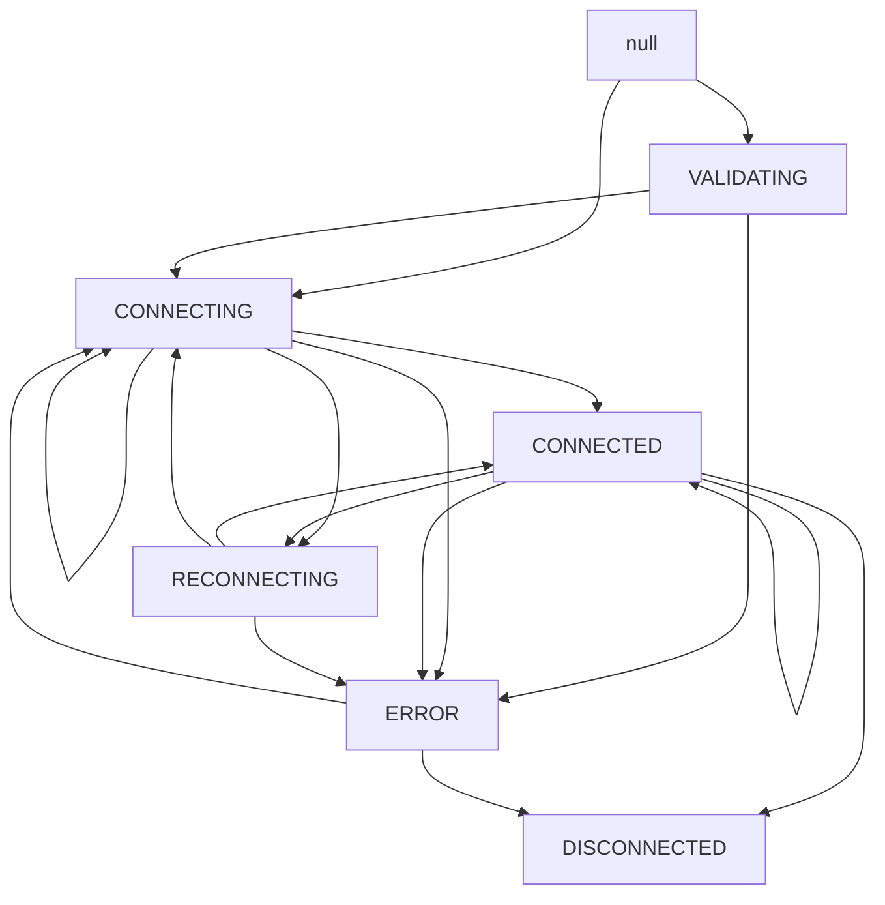
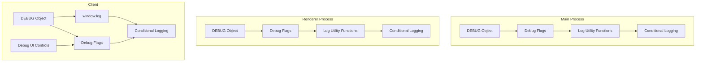

# Kinectron System Patterns

## System Architecture

Kinectron uses a modular architecture separating hardware interaction, data processing, network communication, and debugging within an Electron application.


## Core Patterns

### Handler/Processor Pattern

Each stream type follows this pattern:

1. **Base Classes**:

   - `BaseFrameProcessor`: Interface for processors
   - `BaseStreamHandler`: Interface for handlers

2. **Specialized Implementations**:

   - Processor classes (e.g., `DepthFrameProcessor`)
   - Handler classes (e.g., `DepthStreamHandler`)

3. **Responsibilities**:
   - **Processor**: Transforms raw Kinect data
   - **Handler**: Manages stream lifecycle and broadcasting

### Event-Driven Communication

1. **IPC Communication**: Main to renderer process via Electron IPC
2. **Peer Communication**: WebRTC-based for real-time streaming
3. **Client API**: Event-based interface with callbacks

## Stream Implementation


### Implementation Steps:

1. **Server-Side Processor**: Extends `BaseFrameProcessor`, transforms data
2. **Server-Side Handler**: Extends `BaseStreamHandler`, manages lifecycle
3. **Client-Side API**: Implements stream control methods
4. **Client-Side Processing**: Delivers processed frames to callbacks

## Data Flow


### Raw Depth Data Flow


### Body Tracking Data Flow


### Key Stream Data Flow


### RGBD Stream Data Flow


### Body Tracking Initialization Pattern

1. **Sequential Initialization**:

   - First, ensure any previous tracking is stopped
   - Start cameras with the right options
   - Create the body tracker
   - Create the frame callback
   - Start listening for frames

2. **Error Handling**:

   - Try/catch blocks around critical operations
   - Graceful error recovery
   - Detailed logging for diagnostics

3. **State Management**:
   - Track active state to prevent multiple overlapping initialization attempts
   - Ensure proper cleanup before starting new sessions

### Robust Stream Initialization Pattern

This pattern was developed for the key stream and should be applied to all streams:

1. **Sequential Initialization**:

   ```javascript
   // First, ensure any previous tracking is stopped
   if (this.isActive) {
     console.log('Stopping previous session');
     await this.stopStream();

     // Wait a bit to avoid ThreadSafeFunction error when switching feeds
     await new Promise((resolve) => setTimeout(resolve, 500));
   }

   // Start cameras with the right options
   const success = this.kinectController.startKeyCamera({
     ...KinectOptions.KEY,
   });

   if (success) {
     this.isActive = true;

     // Wait for body tracker to initialize if needed
     await new Promise((resolve) => setTimeout(resolve, 1000));

     // Create the frame callback
     this.createFrameCallback(event);

     // Start listening for frames
     if (!this.isMultiFrame) {
       this.kinectController.startListening(this.frameCallback);
     }
   }
   ```

2. **Comprehensive Error Handling**:

   ```javascript
   try {
     // Stream initialization code
   } catch (error) {
     console.error('Error in stream initialization:', error);
     return this.handleError(error, 'starting stream');
   }
   ```

3. **Robust Stream Stopping**:

   ```javascript
   async stopStream() {
     try {
       // Only try to stop listening if we have a callback
       if (this.frameCallback) {
         try {
           await this.kinectController.stopListening();
         } catch (error) {
           console.warn('Error stopping listening (may be normal):', error.message);
         }
         this.frameCallback = null;
       }

       // Stop cameras
       try {
         await this.kinectController.stopCameras();
       } catch (error) {
         console.warn('Error stopping cameras:', error.message);
       }

       this.isActive = false;

       // Notify peers that stream has stopped
       if (this.peerManager && this.peerManager.isConnected) {
         this.peerManager.broadcast('feed', {
           feed: 'stop',
           type: 'key',
         });
       }
     } catch (error) {
       console.error('Error in stopStream:', error);
       this.handleError(error, 'stopping stream');
     }
   }
   ```

4. **Detailed Logging**:
   - Log each step of the initialization process
   - Log success or failure of each operation
   - Include relevant data in logs for debugging

### Raw Depth Packing Strategy

1. **Current Implementation**:
   - One 16-bit depth value per RGBA pixel
   - Lower 8 bits stored in R channel
   - Upper 8 bits stored in G channel
   - B and A channels unused (set to 0 and 255)
   - Unpacking: `depth = (G << 8) | R`

### Frame Dropping and Buffering Strategy

1. **Lossy Transmission**:

   - All streams use lossy transmission by default
   - Frames are dropped when the network can't keep up
   - Implemented in the `broadcastFrame` method of `BaseStreamHandler`
   - Each stream handler passes `lossy=true` to the `broadcastFrame` method

2. **Buffer Checking**:

   - Before sending a frame, the system checks if there's data in the buffer
   - If the buffer is not empty and the stream is marked as lossy, the frame is dropped
   - This prevents buffer bloat and reduces latency

3. **Implementation**:

   ```javascript
   // In PeerConnectionManager.broadcast method
   this.peer_connections.forEach((connection) => {
     // Check if there is still data in the buffer before adding more information to it.
     // This prevents bandwidth issues from causing latency.
     if (
       lossy &&
       connection.dataChannel &&
       connection.dataChannel.bufferedAmount > 0
     ) {
       return;
     }

     connection.send(message);
   });
   ```

4. **Benefits**:
   - Maintains real-time performance even on slower networks
   - Prioritizes fresh data over complete data
   - Reduces latency by preventing buffer bloat
   - Particularly important for streams like depth, color, and body tracking where real-time feedback is critical

## Component Relationships

1. **KinectController**: Manages hardware interface
2. **Stream Processors**: Transform specific data types
3. **Stream Handlers**: Manage stream lifecycle
4. **PeerConnectionManager**: Handles WebRTC connections
5. **Client API**: Provides interface for web applications
6. **Debugging System**: Controls logging and diagnostics

## Design Patterns Used

1. **Factory Pattern**: Creating processors and handlers
2. **Observer Pattern**: Event handling and notification
3. **Strategy Pattern**: Different processing strategies
4. **Template Method**: Base classes defining algorithms
5. **Adapter Pattern**: Converting between data formats
6. **Facade Pattern**: Simplified debugging interface
7. **Singleton Pattern**: NotificationManager for centralized error handling

## Notification System Architecture


### Notification System Implementation

1. **Singleton Pattern**:

   - Single NotificationManager instance shared across the application
   - Ensures consistent notification handling regardless of entry point
   - Prevents multiple modal dialogs from appearing simultaneously

2. **DOM-Aware Initialization**:

   ```javascript
   initializeModal() {
     // Check if document is already loaded
     if (
       document.readyState === 'complete' ||
       document.readyState === 'interactive'
     ) {
       this._setupModalElements();
     } else {
       // Wait for DOM to be fully loaded
       document.addEventListener('DOMContentLoaded', () => {
         this._setupModalElements();
       });
     }
   }
   ```

3. **Fallback Mechanism**:

   ```javascript
   showModal(options) {
     // Ensure modal elements are initialized
     if (!this._ensureInitialized()) {
       console.error('Modal elements could not be initialized');
       // Fallback to console notification
       console.warn(
         'NOTIFICATION:',
         options.title,
         '-',
         options.message,
       );
       if (options.details) {
         console.warn('Details:', options.details);
       }
       return;
     }

     // Modal display code...
   }
   ```

4. **Asynchronous DOM Handling**:

   - Uses setTimeout to ensure the DOM is ready before showing notifications
   - Prevents race conditions between initialization and notification display
   - Ensures consistent behavior across different initialization paths

5. **User Experience Considerations**:
   - Keeps the "Open Kinect" button active even when initialization fails
   - Provides clear troubleshooting steps for users
   - Ensures consistent error handling between direct and peer-to-peer initialization paths

## Refresh Handling Pattern


1. **Sequential Cleanup**:

   - First clean up the StreamManager to remove all IPC handlers
   - Then close Kinect and peer resources
   - Allow the renderer process to reload

2. **Comprehensive IPC Handler Removal**:

   ```javascript
   // Remove all stream-specific handlers
   const streamTypes = [
     'color',
     'depth',
     'raw-depth',
     'skeleton',
     'key',
     'depth-key',
     'rgbd',
   ];

   streamTypes.forEach((type) => {
     ipcMain.removeHandler(`start-${type}-stream`);
   });

   // Also remove handlers with different naming patterns
   ipcMain.removeHandler('start-body-tracking');
   ```

3. **Resource Reinitialization**:
   - Check if peer server needs to be reinitialized after reload
   - Reinitialize IPC handler to ensure all event listeners are set up
   - Ensure proper error handling during reinitialization

## State Management Patterns

### NgrokClientState Transitions

The NgrokClientState class implements a state machine pattern to manage the connection state of ngrok tunnels. The state machine defines valid transitions between states to ensure the system maintains a consistent state.



Key design decisions:

1. **Self-Transitions**: Some states allow transitions to themselves (e.g., CONNECTED → CONNECTED)

   - This handles cases where multiple data channels open on the same connection
   - Prevents errors when refreshing state metadata without changing the actual state
   - Simplifies client code by not requiring state checks before setState calls

2. **Validation**: The setState method validates transitions using the VALID_TRANSITIONS map

   - Throws NgrokClientError for invalid transitions
   - Ensures the state machine follows the defined flow
   - Helps catch programming errors early

3. **Metadata Updates**: Each state transition updates relevant metadata

   - CONNECTED: Updates startTime if not already set
   - RECONNECTING: Increments reconnect count and records attempt time
   - All transitions: Update lastStateChange timestamp

4. **Event Emission**: State changes trigger events that components can listen for
   - Allows UI components to react to state changes
   - Enables logging and monitoring of state transitions
   - Facilitates debugging of connection issues

## Data Structure Handling Patterns

### Event Data Structure Mismatches

A critical pattern to be aware of is the potential mismatch between data structures in the event pipeline:


**Problem**: Data structures can be nested differently than expected between event producers and consumers.

**Example 1**: In the bodyFrame handler, data was coming in as:

```javascript
{
  data: {
    bodies: [...],
    numBodies: 1
  },
  name: "bodyFrame",
  timestamp: 1743208345517
}
```

But the handler was looking for `data.bodies` directly, causing the callback to never be called.

**Solution**: Extract the nested data before processing:

```javascript
export function createBodyHandler(callback) {
  return (eventData) => {
    const bodyData = eventData.data;
    if (bodyData && bodyData.bodies) {
      callback({
        bodies: bodyData.bodies,
        timestamp: bodyData.timestamp || Date.now(),
        floorClipPlane: bodyData.floorClipPlane,
        trackingId: bodyData.trackingId,
      });
    }
  };
}
```

**Example 2**: In the key stream handler, the server was sending `imageData` (capital 'D') but the client was expecting `imagedata` (lowercase 'd').

**Solution**: Normalize the data structure in the client to handle both formats:

```javascript
// Check for both imagedata and imageData formats
const imageData = frameData.imagedata || frameData.imageData;

if (imageData && imageData.data) {
  // Process the image data
}
```

**Best Practices**:

1. Add proper logging at the beginning of handler functions to verify data structure
2. Standardize data extraction across all handlers
3. Make handlers resilient to different data formats
4. Use consistent naming conventions for data properties
5. Document expected data structures in code comments

## Debugging System Architecture



### Debugging System Implementation

1. **Flag-Based Control**:

   - Category-based flags for specific log types:
     - FRAMES: For frame processing and transmission logs
     - UI: For UI-related logs
     - PEER: For peer connection logs
     - PERFORMANCE: For performance-related logs
     - DATA: For data integrity logs
     - NETWORK: For network-related logs
     - HANDLERS: For stream handler operations
   - All flags default to false (disabled)
   - Helper methods to enable/disable all flags at once

2. **Log Utility Functions**:

   - `log.error()`: Always visible, for error messages
   - `log.warn()`: Always visible, for warning messages
   - `log.info()`: Always visible, for important information
   - `log.frame()`: Only visible when FRAMES flag is enabled
   - `log.ui()`: Only visible when UI flag is enabled
   - `log.peer()`: Only visible when PEER flag is enabled
   - `log.performance()`: Only visible when PERFORMANCE flag is enabled
   - `log.data()`: Only visible when DATA flag is enabled
   - `log.network()`: Only visible when NETWORK flag is enabled
   - `log.handler()`: Only visible when HANDLERS flag is enabled
   - `log.debug(flag, message)`: Only visible when specified flag is enabled

3. **UI Integration**:

   - Checkbox controls in streamTest.html
   - Master toggle enables/disables all debugging
   - Category toggles for fine-grained control

4. **Conditional Logging**:
   - Console logs wrapped with flag checks
   - Console.group() for organizing related logs
   - Essential logs (errors, warnings, important info) always visible
   - Non-essential logs (debug, frame, UI) only visible when flags are enabled
   - Consistent logging pattern across all components

### Global Logging Pattern

To handle the limitations of classic scripts and ES modules in the browser environment, we implemented a global logging pattern:

1. **Export and Expose**:

   ```javascript
   // In module script
   import { DEBUG, log } from '../../src/utils/debug.js';
   window.DEBUG = DEBUG;
   window.log = log;
   ```

2. **Global Access**:

   ```javascript
   // In classic script
   window.log.data('Processing data...');
   ```

3. **Benefits**:
   - Avoids ES module import errors in classic scripts
   - Maintains consistent logging interface across all files
   - Allows for centralized control of debug flags
   - Works with bundlers like Parcel without requiring type="module" on all scripts

## Module Export Pattern

```mermaid
flowchart TD
    subgraph "Export Strategy"
        SrcFiles[Source Files]
        DefaultExport[Default Export]
        ESM[ESM Format]
        CJS[CommonJS Format]
        UMD[UMD Format with PeerJS Bundled]
    end

    subgraph "Import Methods"
        ESImport[import Kinectron from 'kinectron-client']
        CJSImport[const Kinectron = require('kinectron-client')]
        ScriptImport[<script src="kinectron.umd.js"></script>]
    end

    SrcFiles --> DefaultExport
    DefaultExport --> ESM --> ESImport
    DefaultExport --> CJS --> CJSImport
    DefaultExport --> UMD --> ScriptImport
```

### Module Export Implementation

1. **Default Export Only**:

   - The Kinectron class is exported as the default export only
   - This follows best practices for libraries with a single primary class
   - Provides a cleaner, more intuitive API for consumers

   ```javascript
   // In client/src/index.js
   import { Kinectron } from './kinectron.js';
   console.log('You are running Kinectron API version 1.0.0');
   export default Kinectron;
   ```

2. **Import Methods**:

   - ES Modules: `import Kinectron from 'kinectron-client'`
   - CommonJS: `const Kinectron = require('kinectron-client')`
   - Script tag: `<script src="kinectron.umd.js"></script>` (global `Kinectron`)

3. **Benefits**:

   - Cleaner, more idiomatic API for consumers of the library
   - Better interoperability between ESM and CommonJS environments
   - Eliminates confusing warning messages during build
   - Follows modern JavaScript best practices for library exports
   - Simplifies usage for developers

4. **PeerJS Bundling**:

   - PeerJS is now bundled directly into the UMD build
   - Users no longer need to include PeerJS separately
   - Simplified usage with a single script tag
   - Ensures version compatibility between Kinectron and PeerJS
   - Reduces potential for errors from missing dependencies
   - Implementation:
     ```javascript
     // In rollup.config.js
     // Removed from external dependencies to bundle it
     // No external dependencies - bundle everything
     ```

5. **Implementation Details**:
   - Rollup configured to output three formats (ESM, CJS, UMD)
   - Package.json configured with appropriate entry points
   - Examples updated to use the new import style
   - Backward compatible with existing code that uses the default export

## Build System and Development Workflow

```mermaid
flowchart TD
    subgraph "Development Process"
        Clean[Clean Cache]
        Build[Build Client Library]
        Serve[Serve StreamTest]
        Test[Test in Browser]
    end

    subgraph "File Organization"
        SrcFiles[ES Module Source Files (src/)]
        ExampleFiles[Example Applications (examples/)]
        HTMLFiles[HTML Entry Points]
        StyleFiles[CSS Files]
    end

    Clean --> Build --> Serve --> Test
    SrcFiles --> Build
    ExampleFiles --> Serve
    HTMLFiles --> Serve
    StyleFiles --> Serve
```

### Build System Implementation

1. **Parcel Bundler**:

   - Zero-configuration bundler for web applications
   - Handles JavaScript, HTML, CSS, and assets
   - Provides development server with hot module replacement
   - Requires cache management for direct script includes

2. **File Organization**:

   - `src/`: Core client API files (ES modules)
   - `examples/`: Example applications and testing interfaces
     - `streamTest/`: Stream testing interface with visualization tools
     - `test/`: Simple connection testing interface
   - `dist/`: Build output directory (generated by Parcel)

3. **Development Workflow**:
   - Clean script removes cache and build artifacts
   - Build process compiles ES modules into browser-compatible code
   - Serve process starts development server with live reloading
   - Browser testing validates functionality
